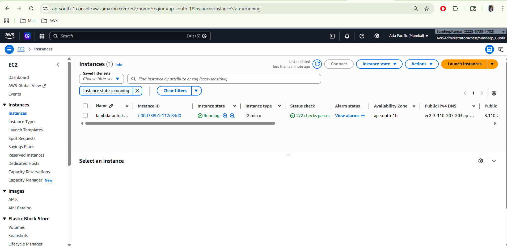
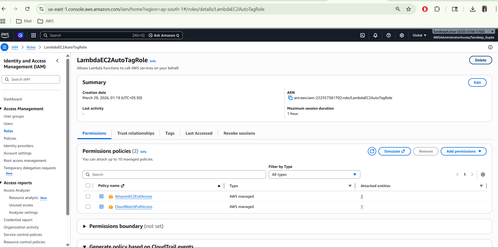
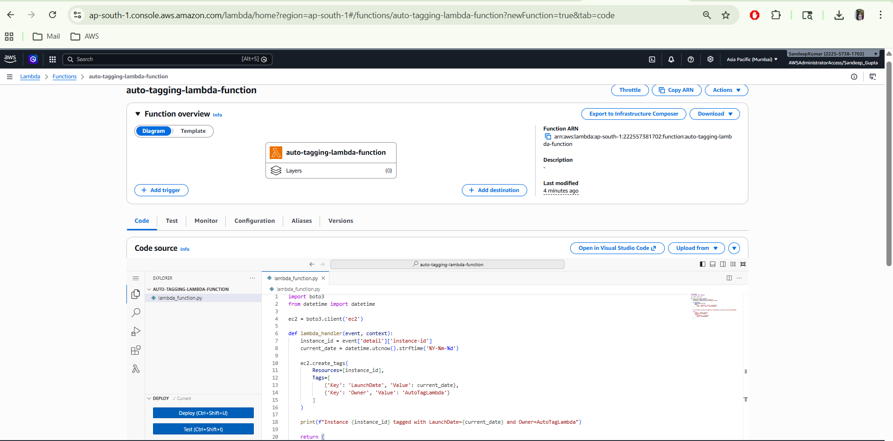
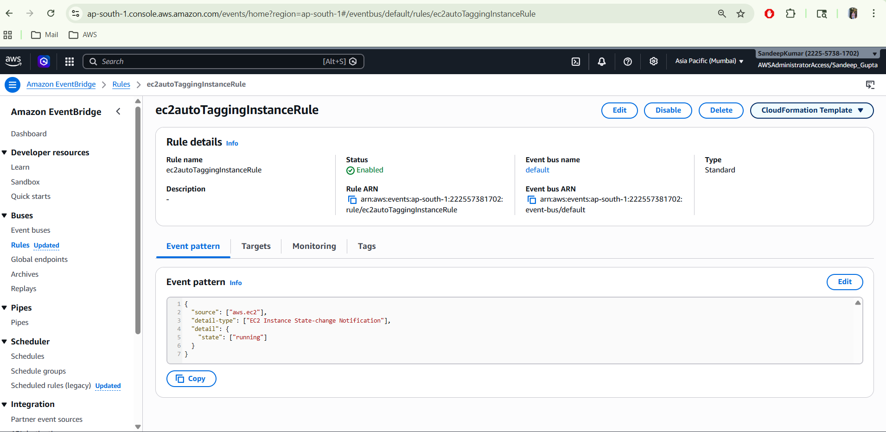
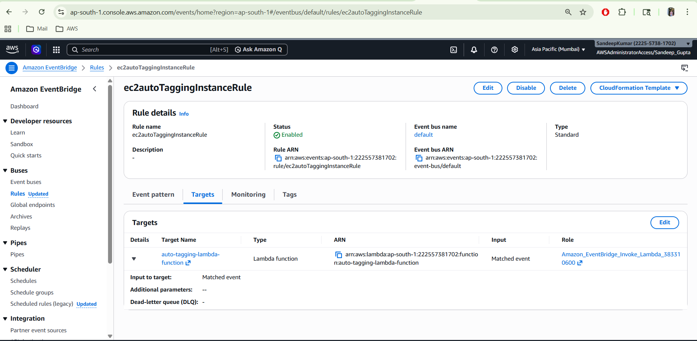
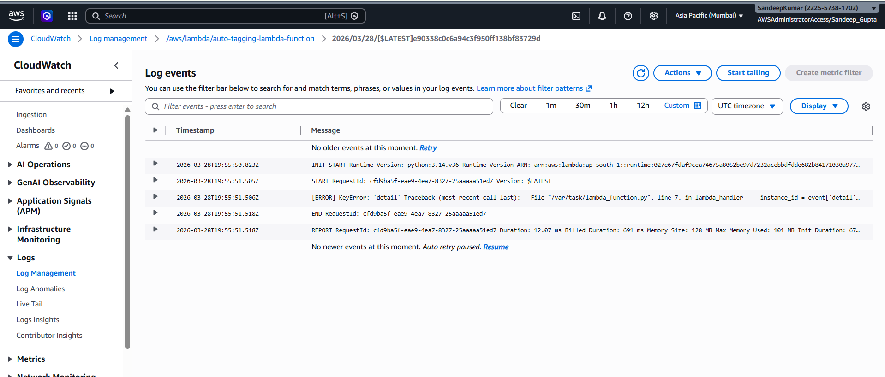
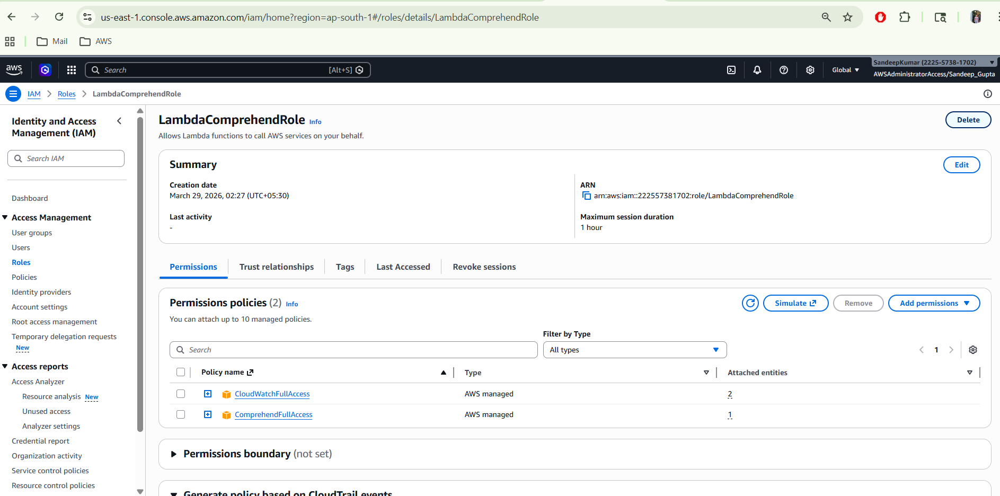
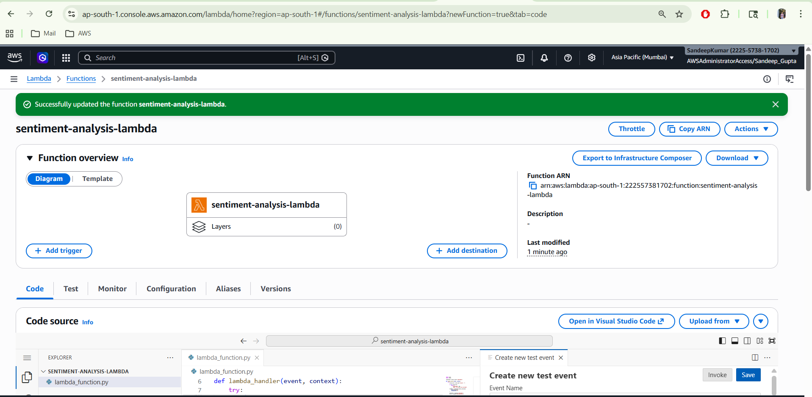

# Serverless Architecture Cloud Automation Assignment

## Assignment 1: Automated Instance Management Using AWS Lambda and Boto3

---

## Step 1: Create EC2 Instances

1. Go to **AWS Console → EC2 → Instances → Launch Instance**
2. Launch a `t2.micro` instance
3. In the **Tags** section, add:
   - **Key:** `Action`
   - **Value:** `Auto-Stop`
4. Launch a **second** `t2.micro` instance and tag it:
   - **Key:** `Action`
   - **Value:** `Auto-Start`

### EC2 Instances Setup


---

## Step 2: Create the IAM Role for Lambda

1. Go to **IAM → Roles → Create role**
2. Select **Trusted entity**: `AWS Service`
3. Choose **Use case**: `Lambda`
4. Attach the policy:
   - `AmazonEC2FullAccess`
5. Name the role:
   - `LambdaEC2ManagerRole`
6. Click **Create role**

---

## Step 3: Create the Lambda Function

1. Go to **AWS Lambda → Create function**
2. Choose **Author from scratch**
3. Configure:
   - **Function name:** `EC2AutoManager`
   - **Runtime:** `Python 3.14`
   - **Execution role:** Use existing role → `LambdaEC2ManagerRole`
4. Click **Create function**
5. Add the Lambda code and click **Deploy**

---

## Step 4: Configure Lambda Function

1. Go to **Configuration → General configuration**
2. Set **Timeout** to `30 seconds`
3. Click **Save**
4. Click **Deploy**

---

## Step 5: Test the Lambda Function

1. Go to the **Test** tab
2. Create a new test event:
   - **Event name:** `ec2StartStopTest`
3. Click **Test**
4. Verify the **Execution results**

### Lambda Execution Output


---

## Step 6: Verify EC2 Instance Status

1. Go to **EC2 → Instances**
2. Verify:
   - Instance tagged `Action=Auto-Stop` → **Stopped / Stopping**
   - Instance tagged `Action=Auto-Start` → **Running / Pending**

---

## Technologies Used
- AWS EC2
- AWS Lambda
- AWS IAM
- Python 3.14

------------------------------------------------------------------------

# Assignment 2: Automated S3 Bucket Cleanup Using AWS Lambda and Boto3

## Objective

Automate deletion of files older than **30 days** from an S3 bucket
using AWS Lambda and Boto3.

------------------------------------------------------------------------

# Architecture

S3 Bucket (Files Stored) ↓ AWS Lambda (Python + Boto3) ↓ Delete Files
Older Than 30 Days

------------------------------------------------------------------------

# Step 1: Create S3 Bucket

1.  Go to **AWS Console → S3**
2.  Click **Create Bucket**
3.  Example bucket name:

cleanup-file-bucket

4.  Upload multiple files.

Ensure: - Some files are **older than 30 days** - Some files are
**recent**

Screenshot


------------------------------------------------------------------------

# Step 2: Create IAM Role for Lambda

1.  Open **IAM → Roles**
2.  Click **Create Role**
3.  Select **Lambda**
4.  Attach policy:

AmazonS3FullAccess

5.  Role Name:

LambdaS3CleanupRole

Screenshot


------------------------------------------------------------------------

# Step 3: Create Lambda Function

Configuration:

Function Name: S3BucketCleanup\
Runtime: Python 3.x\
Execution Role: LambdaS3CleanupRole

Screenshot


------------------------------------------------------------------------

# Step 4: Lambda Code

``` python
import boto3
from datetime import datetime, timezone, timedelta

s3 = boto3.client('s3')

BUCKET_NAME = "cleanup-file-bucket"
DAYS = 30

def lambda_handler(event, context):

    deleted_files = []

    response = s3.list_objects_v2(Bucket=BUCKET_NAME)

    if 'Contents' not in response:
        print("Bucket is empty")
        return

    for obj in response['Contents']:

        file_name = obj['Key']
        last_modified = obj['LastModified']

        file_age = datetime.now(timezone.utc) - last_modified

        if file_age > timedelta(days=DAYS):

            s3.delete_object(
                Bucket=BUCKET_NAME,
                Key=file_name
            )

            deleted_files.append(file_name)
            print(f"Deleted: {file_name}")

    if not deleted_files:
        print("No old files found")

    return {
        'statusCode': 200,
        'deleted_files': deleted_files
    }
```

------------------------------------------------------------------------

# Step 5: Test Lambda

1.  Click **Deploy**
2.  Click **Test**
3.  Create test event

Event Name: cleanupTest
------------------------------------------------------------------------

# Step 6: Verify Results

After running Lambda:

  File Age             Result
  -------------------- ---------
  Older than 30 days   Deleted
  Newer than 30 days   Remains
------------------------------------------------------------------------

# Assignment 5: Auto-Tagging EC2 Instances on Launch Using AWS Lambda and Boto3

## Objective

Automatically tag EC2 instances at launch using AWS Lambda.

------------------------------------------------------------------------

# Architecture

EC2 Launch → EventBridge → Lambda → Auto Tagging

------------------------------------------------------------------------

# Step 1: EC2 Setup

Go to AWS EC2 dashboard.

Screenshot 

------------------------------------------------------------------------

# Step 2: IAM Role

Policy: AmazonEC2FullAccess

Role Name: LambdaEC2AutoTagRole

Screenshot 

------------------------------------------------------------------------
# Step 3: Lambda Function

Function Name: auto-tagging-lambda-function\
Runtime: Python 3.x

Screenshot 

------------------------------------------------------------------------

# Step 4: Code

``` python
import boto3
from datetime import datetime

ec2 = boto3.client('ec2')

def lambda_handler(event, context):
    instance_id = event['detail']['instance-id']
    current_date = datetime.utcnow().strftime('%Y-%m-%d')
    
    ec2.create_tags(
        Resources=[instance_id],
        Tags=[
            {'Key': 'LaunchDate', 'Value': current_date},
            {'Key': 'Owner', 'Value': 'AutoTagLambda'}
        ]
    )
    
    print(f"Instance {instance_id} tagged with LaunchDate={current_date} and Owner=AutoTagLambda")
    
    return {
        "status": "Tagging complete",
        "instance_id": instance_id,
        "tags": {
            "LaunchDate": current_date,
            "Owner": "AutoTagLambda"
        }
    }
```
------------------------------------------------------------------------

# Step 5: EventBridge Rule

Event: EC2 → State change → running

Screenshot 

------------------------------------------------------------------------

# Step 6: Add Target

Lambda: ec2autoTaggingInstanceRule

Screenshot 

------------------------------------------------------------------------

# Step 7: Test

Launch EC2 instance

------------------------------------------------------------------------

# Step 8: Verify

Check Tags:

LaunchDate → Date\

------------------------------------------------------------------------

# Step 9: CloudWatch Logs

1.  Go to Lambda → Monitor
2.  Click **View CloudWatch Logs**
3.  Open latest log stream

Screenshot 

------------------------------------------------------------------------
# Assignment 8: Sentiment Analysis Using AWS Lambda & Amazon Comprehend

---

## Objective
Automatically analyze and categorize the sentiment of user reviews using Amazon Comprehend.

---

## Services Used
- AWS Lambda
- Amazon Comprehend
- IAM
- CloudWatch Logs

---


## Step-by-Step Implementation

### Step 1: Create IAM Role

1. Go to IAM Dashboard
2. Click Roles → Create Role
3. Select AWS Service → Lambda
4. Attach Policy: ComprehendFullAccess, CloudWatchFullAccess
5. Name: LambdaComprehendRole

Screenshot:


---

### Step 2: Create Lambda Function

1. Go to AWS Lambda
2. Click Create Function
3. Choose:
   - Author from scratch
   - Runtime: Python 3.x
4. Assign IAM Role

Screenshot:


---

### Step 3: Add Lambda Code

```python
import json
import boto3

comprehend = boto3.client('comprehend')

def lambda_handler(event, context):
    try:
        # 1. Get review text from event
        review_text = event.get("review", "")

        if not review_text:
            return {
                "statusCode": 400,
                "body": "No review text provided"
            }

        # 2. Call Amazon Comprehend
        response = comprehend.detect_sentiment(
            Text=review_text,
            LanguageCode='en'
        )

        sentiment = response['Sentiment']
        score = response['SentimentScore']

        # 3. Log result
        print(f"Review: {review_text}")
        print(f"Sentiment: {sentiment}")
        print(f"Scores: {score}")

        # 4. Return response
        return {
            "statusCode": 200,
            "review": review_text,
            "sentiment": sentiment,
            "score": score
        }

    except Exception as e:
        print("Error:", str(e))
        return {
            "statusCode": 500,
            "error": str(e)
        }
```

---

### Step 4: Test Lambda Function

#### Sample Input

```json
{
  "review": "Excellent service and very fast delivery!"
}
```

Screenshot:


---

### Step 5: Verify Output in CloudWatch

1. Go to Monitor Tab
2. Click View Logs in CloudWatch
3. Check sentiment output

---

## Sample Output

```json
{
  "statusCode": 200,
  "sentiment": "POSITIVE"
}
```
----

